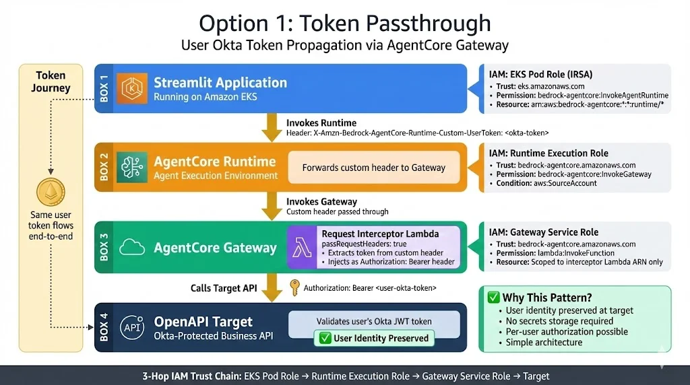

# AgentCore Authentication Propagation Examples

This repository contains different authentication propagation patterns for AWS Bedrock AgentCore Gateway.

**Verified against AWS Documentation - January 2026**

## Pattern Comparison

| Aspect | Option 1: Token Passthrough | Option 2: Token Broker |
|--------|----------------------------|------------------------|
| **Use Case** | User identity needed at target | Service-to-service auth |
| **Token at Target** | User's Okta JWT | Service account token |
| **Secrets Storage** | None required | Secrets Manager (central account) |
| **IAM Trust Chain** | 3-hop | 5-hop |
| **Complexity** | Simple | More complex |

---

## Option 1: Token Passthrough

End-user identity propagation - the user's Okta JWT token flows end-to-end from Streamlit through AgentCore to the Target API.



**When to use:**
- User identity must be preserved at target
- Per-user authorization required
- No cross-account secrets needed
- Simple architecture preferred

📁 **Implementation:** [option1-token-passthrough/](option1-token-passthrough/)

---

## Option 2: Token Broker

Centralized credential retrieval - the interceptor calls a Token Broker service in a central account to get service account credentials.


**When to use:**
- Cross-account secrets required
- Service-to-service authentication
- Centralized credential rotation
- User identity NOT needed at target

📁 **Documentation:** [option2-token-broker/](option2-token-broker/) *(Planned)*

---

## Directory Structure

```
auth-propagation/
├── images/
│   ├── option1-architecture.png
│   └── option2-architecture.png
├── option1-token-passthrough/    # ✅ Implemented
│   ├── streamlit/                # Frontend (boto3 header injection)
│   ├── agent/                    # AgentCore Runtime agent
│   ├── interceptor/              # Gateway Lambda (CORRECTED format)
│   ├── target-api/               # Backend API (JWT validation)
│   ├── deploy.py                 # Deployment automation
│   └── README.md
├── option2-token-broker/         # 📋 Planned
│   └── README.md
└── README.md                     # This file
```

## AWS Documentation References

- [Runtime Header Allowlist](https://docs.aws.amazon.com/bedrock-agentcore/latest/devguide/runtime-header-allowlist.html)
- [Gateway Interceptor Types](https://docs.aws.amazon.com/bedrock-agentcore/latest/devguide/gateway-interceptors-types.html)
- [Gateway Header Propagation](https://docs.aws.amazon.com/bedrock-agentcore/latest/devguide/gateway-headers.html)
- [Gateway Agent Integration](https://docs.aws.amazon.com/bedrock-agentcore/latest/devguide/gateway-agent-integration.html)
