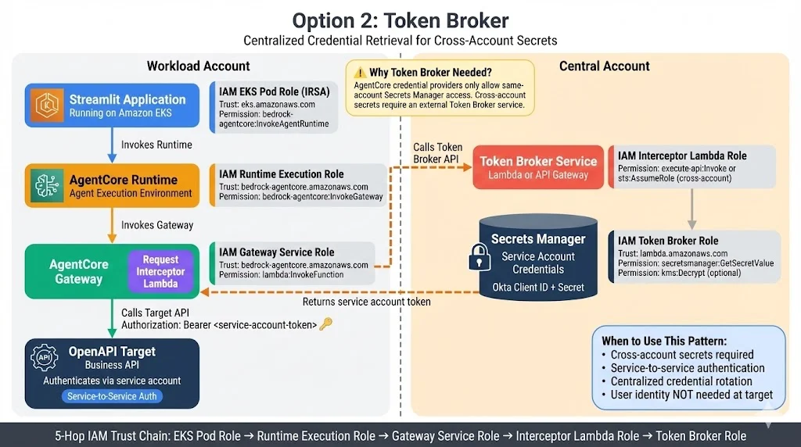

# Option 2: Token Broker

**Centralized Credential Retrieval for Cross-Account Secrets**

## Architecture



## Overview

This pattern enables service-to-service authentication where the Gateway Interceptor calls a Token Broker service in a central account to retrieve service account credentials from Secrets Manager.

## Why Token Broker?

> ⚠️ **AgentCore credential providers only allow same-account Secrets Manager access.**
> 
> Cross-account secrets require an external Token Broker service.

## Token Flow

| Step | Component | Action |
|------|-----------|--------|
| 1 | Streamlit → Runtime | Invokes agent (no user token needed) |
| 2 | Agent → Gateway | Calls MCP endpoint |
| 3 | Interceptor → Token Broker | Requests service credentials |
| 4 | Token Broker → Secrets Manager | Retrieves Okta Client ID + Secret |
| 5 | Interceptor → Target | `Authorization: Bearer <service-account-token>` |

## IAM Trust Chain (5-Hop)

```
EKS Pod Role → Runtime Execution Role → Gateway Service Role → Interceptor Lambda Role → Token Broker Role
```

| Role | Trust | Key Permission |
|------|-------|----------------|
| EKS Pod Role (IRSA) | `eks.amazonaws.com` | `bedrock-agentcore:InvokeAgentRuntime` |
| Runtime Execution Role | `bedrock-agentcore.amazonaws.com` | `bedrock-agentcore:InvokeGateway` |
| Gateway Service Role | `bedrock-agentcore.amazonaws.com` | `lambda:InvokeFunction` |
| Interceptor Lambda Role | `lambda.amazonaws.com` | `execute-api:Invoke`, `sts:AssumeRole` |
| Token Broker Role | `lambda.amazonaws.com` | `secretsmanager:GetSecretValue`, `kms:Decrypt` |

## When to Use This Pattern

✅ **Use Token Broker when:**
- Cross-account secrets are required
- Service-to-service authentication needed
- Centralized credential rotation is desired
- User identity is NOT needed at target

❌ **Don't use when:**
- User identity must be preserved at target → Use [Option 1](../option1-token-passthrough/)
- Same-account secrets only → Use AgentCore credential providers
- Simple architecture is preferred → Use [Option 1](../option1-token-passthrough/)

## Implementation Status

📋 **Planned** - This pattern is documented but not yet implemented.

## Planned Structure

```
option2-token-broker/
├── workload-account/
│   ├── streamlit/                # Frontend application
│   ├── agent/                    # AgentCore Runtime agent
│   ├── interceptor/              # Interceptor that calls Token Broker
│   └── target-api/               # Backend API (service auth)
├── central-account/
│   ├── token-broker/             # Lambda or API Gateway
│   └── secrets-manager/          # Terraform/CloudFormation for secrets
├── iam-roles/                    # Cross-account IAM roles
├── deploy.py                     # Multi-account deployment
└── README.md
```

## Comparison with Option 1

| Aspect | Option 1: Token Passthrough | Option 2: Token Broker |
|--------|----------------------------|------------------------|
| Token at Target | User's Okta JWT | Service account token |
| Interceptor Action | Pass through user token | Call Token Broker for service token |
| Secrets | None | Secrets Manager (central account) |
| Cross-Account | No | Yes |
| User Identity | ✅ Preserved | ❌ Not preserved |
| IAM Hops | 3 | 5 |

## AWS Documentation

- [Runtime Headers](https://docs.aws.amazon.com/bedrock-agentcore/latest/devguide/runtime-header-allowlist.html)
- [Interceptor Types](https://docs.aws.amazon.com/bedrock-agentcore/latest/devguide/gateway-interceptors-types.html)
- [Header Propagation](https://docs.aws.amazon.com/bedrock-agentcore/latest/devguide/gateway-headers.html)
